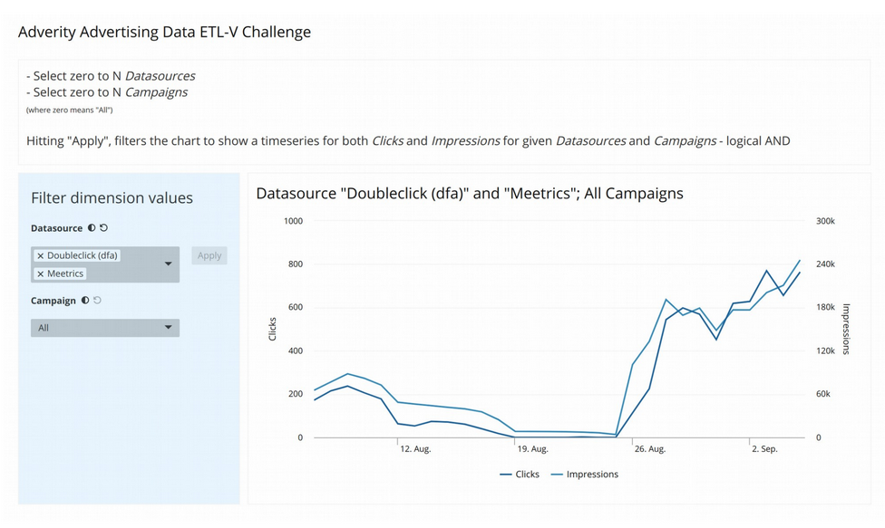

# Advertising Data

The project is build using (Ant Design)[https://ant.design/] as UI library and [Rechart](https://recharts.org) for plotting.

## Architecture

The project is split in components and communicate between each other via `App` view component.

Data is fetched and converted from string to list, without any manipulation.

Final chart values are summed for matching dates, while undefined campaigns and sources are discarded.

## Run the project

As default React configuration, run `yarn start` and open browser at `http://localhost:3000`. 

## Task

> Advertising Data ETL-V
> 
> You are going to write a simple web application, that fetches advertising data from a given endpoint
> to eventually visualize it on a simple interactive dashboard.
> For this, you need to first extract the data (a CSV file) from here:
> 
> http://adverity-challenge.s3-website-eu-west-1.amazonaws.com/DAMKBAoDBwoDBAkOBAYFCw.csv
>
> The data contains:
> 
> - one time dimension (Date)
> - two regular dimensions (Campaign, Datasource)
> - two metrics (Clicks, Impressions)
>
> The goal is to provide a simple dashboard, that shows those metrics for given regular dimension
> values (as user input) over time. It could look like this:
> 
> 
>
> Initially, no Datasource or Campaign is selected, hence the chart should show Clicks and
> Impressions over time for the entire data set. Users can then filter the dataset for both Datasources
> and Campaigns.
> Keep your UI/UX simple and only implement basic functionalities. The focus lies on the proper
> design of your application.
> 
> If not told otherwise, use one of the following tech stacks:
> A) React Frontend only
> Use react with
> - create-react-app to bootstrap your application
> - with a proper design of your components
> - react hooks to manage state and side effects
> - lodash to transform your data
> - an idiomatic functional programming approach with javascript / es6
>
> to implement the entire application as a pure frontend application - that fetches the data, does the
> heavy computation and visualizes the result.

## Remarks

- The data computation is done without use Lodash, as I was unable to identify the right functions
- Tests are limited exclusively to the parsing functionality

## Crossed complexity

- Requirement have been not extremely clear to me, specifically what was intended with `two regular dimensions` and `two metrics`
- The aggregation task of the metrics has not be clear on a first glance
